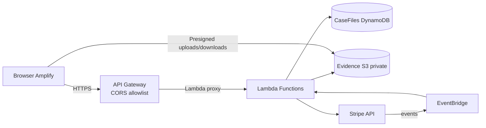

# Deposit Letter App - DevOps Overview

**What it does**  
Helps landlords and property managers generate security-deposit letters and evidence packets. Users enter case data, pay $2 via Stripe, and download a court-ready packet. Evidence is stored privately in S3.

**Who this is for**  
Business stakeholders, landlords, and security reviewers. Plain language, no AI jargon.

## Architecture at a glance
- **Frontend**: Next.js on AWS Amplify (`web/`). Talks to the API with `x-case-token` for case-level access.
- **API**: API Gateway (REST) with CORS restricted to the configured frontend origin; headers allow `x-case-token`.
- **Compute**: Lambda handlers (`infra/lambda/*`) for cases, payments, PDF generation, evidence uploads, and Stripe events.
- **Data**: DynamoDB `CaseFiles` (case metadata, status, case secret); S3 evidence bucket (private, versioned).
- **Payments**: Stripe PaymentIntent/Checkout. Charge is **$2.00** (200 cents). Case must be `PAID` before packet generation.

## Diagram (Mermaid)

## Security posture
- CORS locked to the frontend origin; `x-case-token` allowed on preflight.
- Case-level auth via `caseSecret` sent in `x-case-token`.
- Encryption at rest: S3 managed keys; DynamoDB default encryption. In transit: HTTPS only.
- S3 Block Public Access enabled; evidence accessed only via short-lived presigned URLs.
- Least-privilege IAM: Lambdas scoped to the DynamoDB table, evidence bucket, and read-only Stripe secret.
- Logging: CloudWatch Logs per function (retention 2 years).

## Deploy & configure
Prereqs: Node/npm and AWS credentials for the target account/region.

**Backend (CDK, infra/):**
1) `npm --prefix infra install` (first time)  
2) `npm --prefix infra run cdk deploy -- --parameters FrontendUrl=https://<your-frontend-domain>`

**Frontend (Amplify, web/):**
- Env vars: `NEXT_PUBLIC_API_BASE_URL` (API Gateway stage URL), `NEXT_PUBLIC_STRIPE_PUBLISHABLE_KEY`.
- Build (see `amplify.yml`): `npm ci && npm run build`.

## Operations
- Payments are $2.00 (PaymentIntent amount 200 cents).
- Packet generation only runs when `paymentStatus = PAID`.
- Evidence uploads use presigned URLs; bucket remains private.
- Monitor via CloudWatch Logs (Lambda) and API Gateway 4XX/5XX metrics.
- Tunables without code changes: `FrontendUrl` CDK parameter; Stripe secret in Secrets Manager.

## Key directories
- `web/` - Next.js frontend.
- `infra/` - CDK infrastructure and Lambda sources under `infra/lambda/`.
